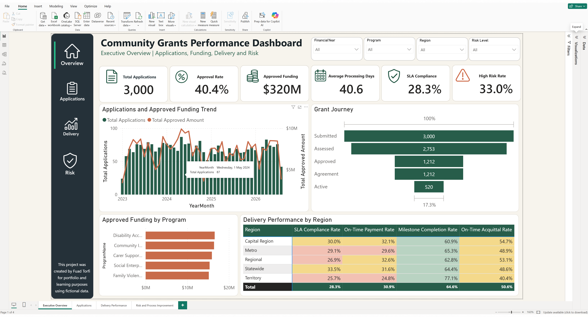
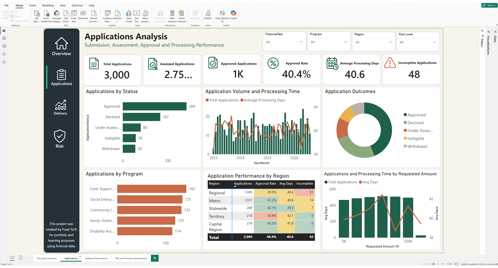
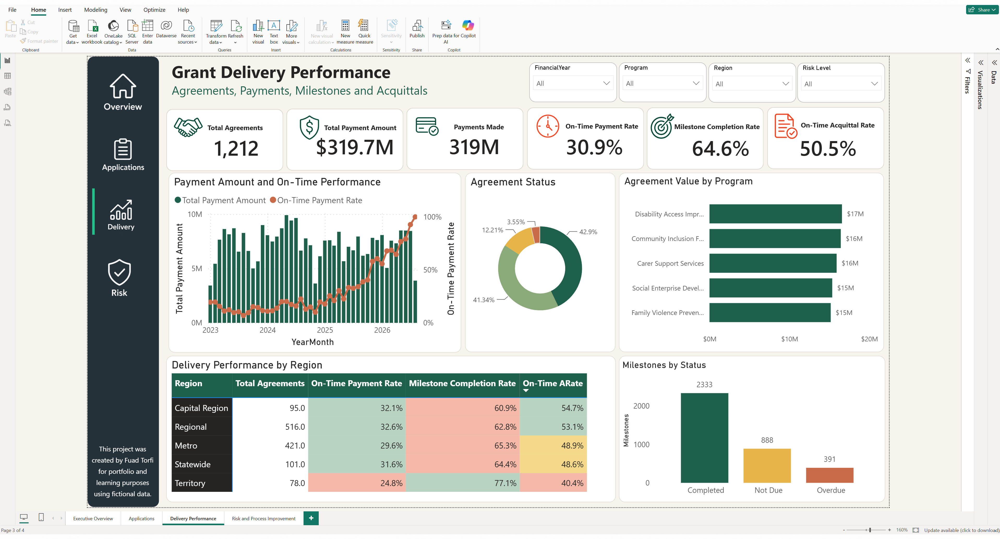
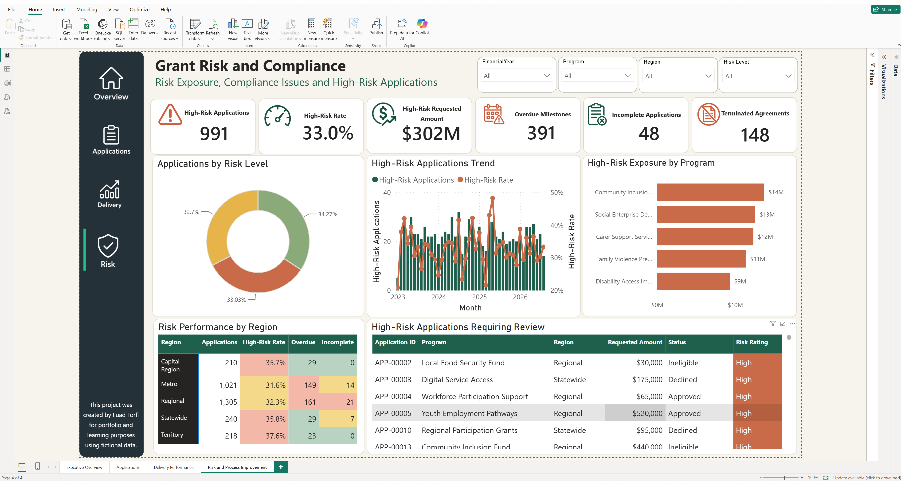

# Community Grants Performance Dashboard

A four-page Power BI dashboard created by Fuad Torfi to analyse fictional community grants data.

## Dashboard Pages

1. Executive Overview
2. Applications Analysis
3. Grant Delivery Performance
4. Grant Risk and Compliance

## Key Features

- Application and approval analysis
- Grant agreement and payment tracking
- Milestone and acquittal monitoring
- Regional performance analysis
- High-risk application identification
- Interactive filters and navigation
- Conditional formatting and KPI cards

## Tools Used

- Power BI Desktop
- Power Query
- DAX
- Microsoft Excel
- Data modelling
- Data visualisation

## Screenshots

### Executive Overview

## Disclaimer

This project was created by Fuad Torfi for portfolio and learning purposes using fictional data.
